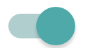

# react-simple-toggle
[](https://www.npmjs.com/package/react-simple-toggle)
Simple React Toggle component

## Demo
[](https://carlos-dev.github.io/react-simple-toggle)

[Live demo](https://carlos-dev.github.io/react-simple-toggle)

## Getting Started
### Installation
```
npm install react-simple-toggle --save
```
## Usage
### Component
```javascript
import React, { Component } from 'react';
import { Toggle } from 'react-simple-toggle';

class MyComponent extends Component {
	handleChange(checked){
		console.log(checked);
	}

	render(){
		return (
			<div>
				<Toggle
					defaultValue={true}
					onChange={this.handleChange}
				/>
			</div>
		)
	}
}

```
### Options
| name | type | default value |
| -----|------|---------------|
| className | string | 'toggle' |
| defaultValue | boolean | false |
| onChange | function | null |
| checked | boolean | null |

## Style
The styling is completely separated from the component in order to make easy to integrate with the styling of your app. Create your css taking into account this tree:

```
|-- toggle toggle--checked
    |-- toggle__left
    |-- toggle__center
    |-- toggle__right
```
Notes:
- "toggle" can be replaced by className prop
- toggle--checked is only present when is toggled

However, you can use one of the stylesheets provided in [style folder](https://github.com/carlos-dev/react-simple-toggle/tree/master/style)
```
require('node_modules/react-simple-toggle/style/android.css')
```
more styles coming soon
